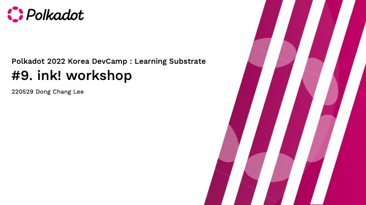
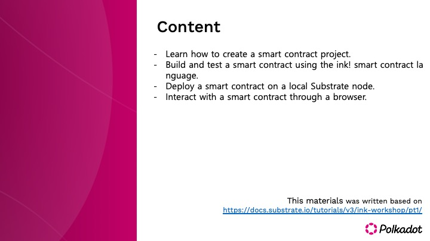
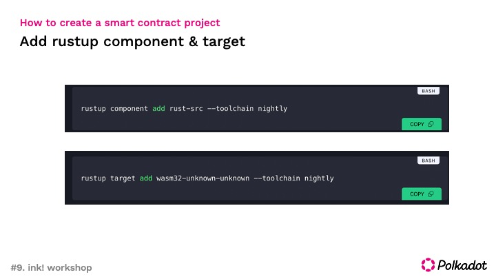
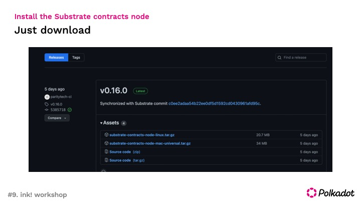
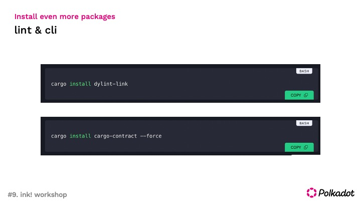
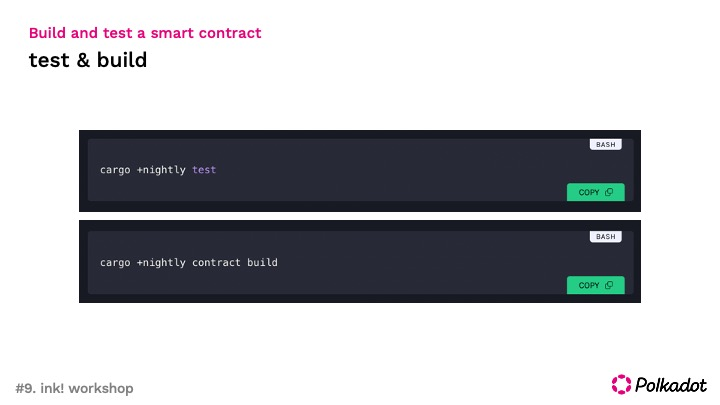
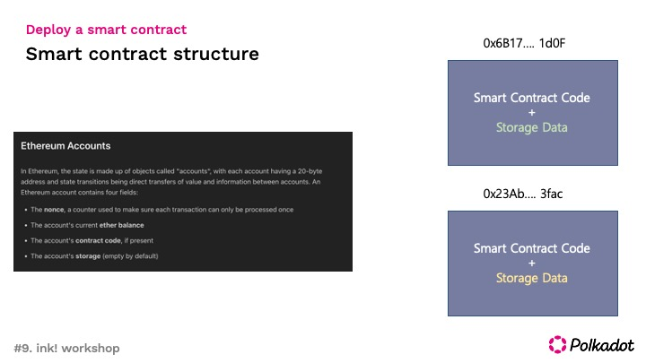
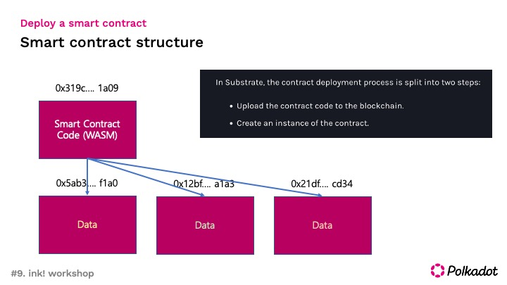
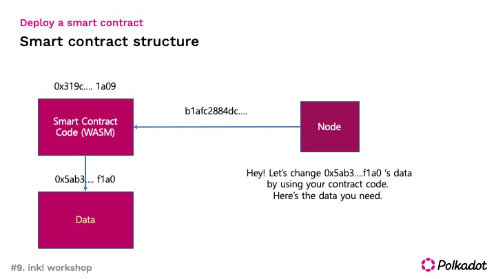
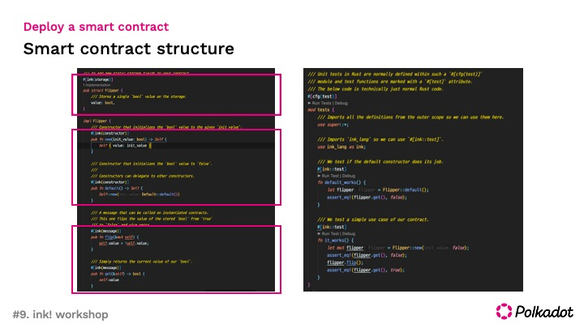

# repo-guide

Prepare your first contract
[Reference material](https://docs.substrate.io/tutorials/v3/ink-workshop/pt1/)

**Collaborators** : [Jeong So Youn](https://github.com/JeongSoYoun) [Kyoung Won Jeong](https://github.com/kyoungwon51) [Dong Chang Lee](https://github.com/leedc0101)

## Contents

