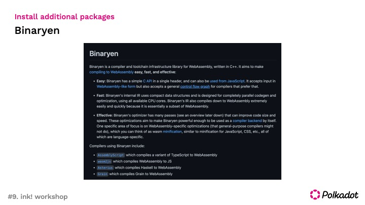

# Substrate tutorial #9 ink! workshop

### Reference materials
- [Prepare your first contract](https://docs.substrate.io/tutorials/v3/ink-workshop/pt1/)
- [ink! documentation](https://docs.substrate.io/tutorials/v3/ink-workshop/pt1/)
- [Contract module source code](https://github.com/paritytech/substrate/tree/master/frame/contracts)

### Collaborators  
- [Jeong So Youn](https://github.com/JeongSoYoun) 
- [Kyoung Won Jeong](https://github.com/kyoungwon51) 
- [Dong Chang Lee](https://github.com/leedc0101)

## Contents

